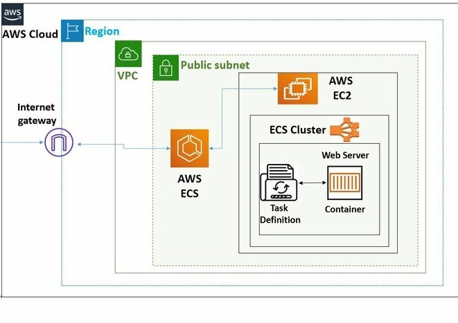

# aws-ECS-and-ECR
Create a docker image on ECR and then push into the ECS . Using these images launch  a container on AWS.

What is ECR ?
  Amazon Elastic Container Registry (ECR) is a fully managed container registry that makes it easy to store, manage, share,
and deploy your container images and artifacts anywhere.

   

1. Here, create a docker image on ECR through dockerfile. First a create a IAM role for connect a ec2 and ecr.
   with attach a two permission policy for theis role.

   
   

2. Then , While launch a EC2 machine , attach a role what we created a iam role.
   Here , I mentioned a several command what I want to install when lanunch a instance machine.

       #! /bin/bash
       apt-get update
       apt install docker.io -y
       systemctl start docker

    
    
    

3. After a ec2 machine sucsessfully launched , I check ,is docker installed or not ?

   

4. To access a aws service , we should install a aws-cli on machine..

       sudo snap install aws-cli --classic
   
   

5. Let's , we create a ecr repository, There is nothing inside a repository

   
   
   

6. Top of the right side into the repository , They instruced ,How to create and push into a repository

    

7. This my docker image  code into dockerfile. First create a dockerfile on your macine then copy the above code.

    

8. Using these push commands, to build a docker image and push into ecr.

    

       sudo docker build adapterregistry .

   

9. After a build a docker image , check once docker images

        sudo docker images

10. If yo got an error like this...I think you have forgetten to attach a iam role on the ec2 machine.
    error : no basic auth credentials

    

11. After attach a role successfully , retry a steps docker build

    

12. Check on your ecr repository

    

    we successfully create and push docker image into a ecr .
   
